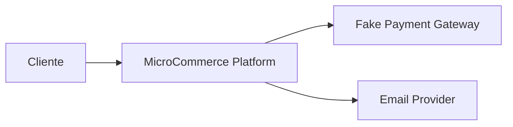
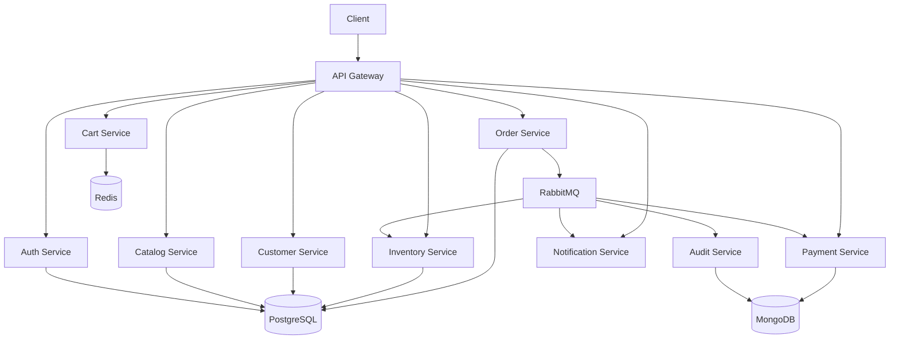
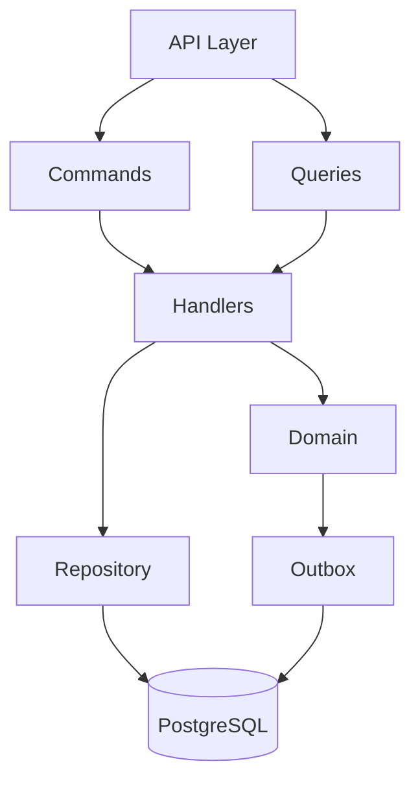
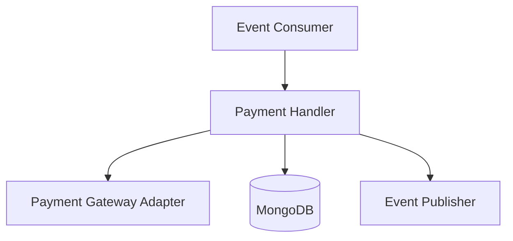
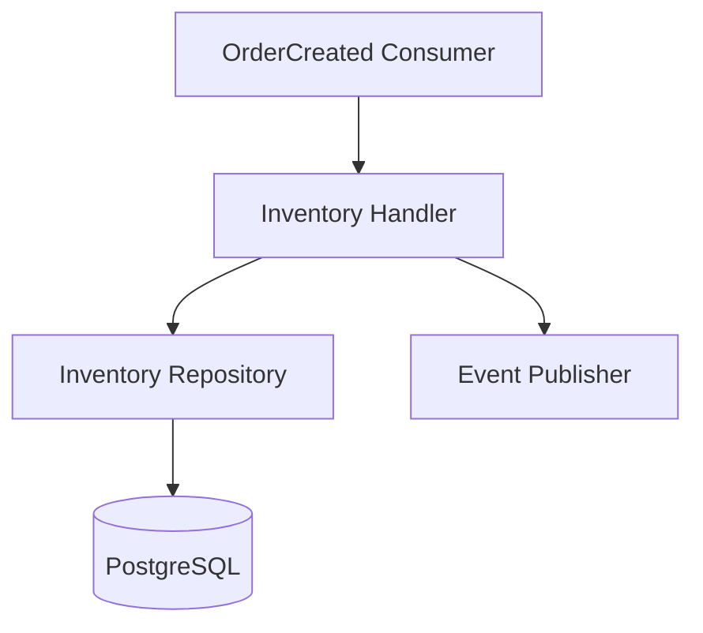
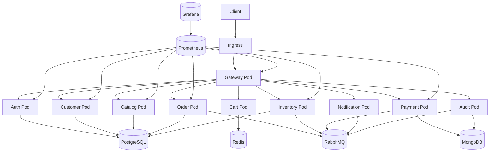
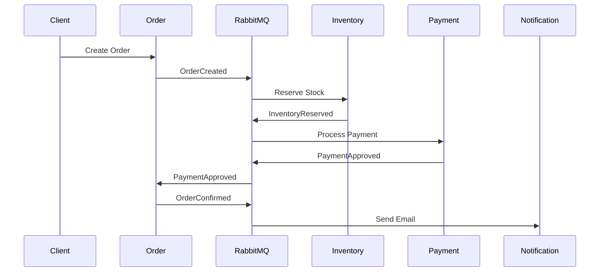
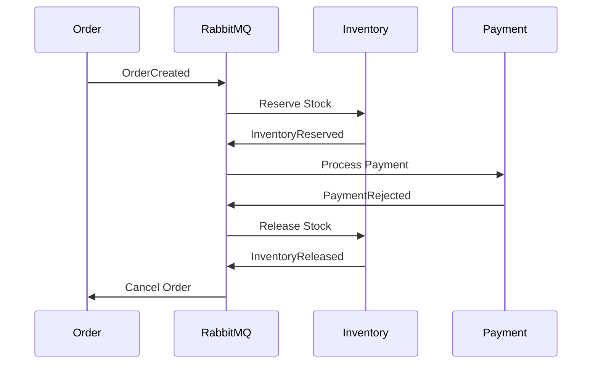

# C4_MODEL.md

# MicroCommerce - C4 Model

Este documento descreve a arquitetura do sistema utilizando o modelo C4.

Níveis:

* Level 1 - Context Diagram
* Level 2 - Container Diagram
* Level 3 - Component Diagram
* Level 4 - Deployment Diagram

---

# Level 1 - System Context Diagram

Visão geral dos usuários e sistemas externos.

---

## Descrição

### Cliente

Usuário final que realiza compras.

### MicroCommerce

Plataforma de e-commerce baseada em microservices.

### Payment Gateway

Sistema externo utilizado para simular pagamentos.

### Email Provider

Sistema externo responsável pelo envio de notificações.

---

# Level 2 - Container Diagram

Visão dos containers principais.

---

## Containers

### API Gateway

Responsável por:

* Autenticação
* Rate Limiting
* Roteamento

---

### Auth Service

Responsável por:

* Login
* JWT
* Refresh Token

---

### Customer Service

Responsável por:

* Clientes
* Endereços

---

### Catalog Service

Responsável por:

* Produtos
* Categorias

---

### Cart Service

Responsável por:

* Carrinho

---

### Order Service

Responsável por:

* Pedidos

---

### Inventory Service

Responsável por:

* Estoque

---

### Payment Service

Responsável por:

* Pagamentos

---

### Notification Service

Responsável por:

* Notificações

---

### Audit Service

Responsável por:

* Auditoria

---

# Level 3 - Component Diagram

Order Service.

---

## Componentes

### API Layer

Endpoints HTTP.

---

### Commands

Operações de escrita.

---

### Queries

Operações de leitura.

---

### Handlers

Executam regras de negócio.

---

### Domain

Entidades e regras.

---

### Repository

Persistência.

---

### Outbox

Persistência dos eventos.

---

# Component Diagram - Payment Service

---

# Component Diagram - Inventory Service

---

# Level 4 - Deployment Diagram

Ambiente Kubernetes.

---

# Fluxo de Negócio Principal

---

# Fluxo de Compensação

